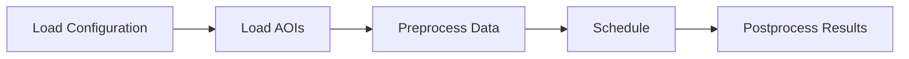

# Satellite coverage

This repository is still under construction and should be considered in an *beta* state.


Additional, non-MVP remaining tasks:
* [] generate coverage report in CZML and in csv
* [] adjust score to prefer non-covered areas, penalizing repeating coverage
* [] add entrypoint for easy script use
* [] add modularity for use as a module, rather than an application (maybe?)

## tl;dr

Build and activate the conda environment from the `environment.yaml`

```bash
mamba env create -f environment.yaml
mamba activate sat-scheduler
python src --help

python src [tool] --help
```

## Scheduler overview

This scheduler provides the framework into which several scheduler algorithms can be implemented.  At the high level, the workflow is as follows:



### Load configuration

Validate the configuration loaded from a file or provided via code. This configuration is stored as a global and accessed via the `satscheduler.configuration.get_config()` method.

See the [Configuration](#configuration) section below for details on the configuraiton values.

The default processing performs the following:

1. Load the `config.yaml` file (or file specified via the `--config FILE` command line parameter).
2. Verify the configuration by parsing it into a `satscheduler.configuration.Configuration` instance.
3. Set that instance as the global configuration value.

### Load AOIs

Loading areas-of-interest (AOIs) from the provided url.  The `satscheduler.aoi.Aoi` class represents a single area of interest. The rest of the `satscheduler.aoi` module provides a set of methods to load them from a set of countries. The default processing performs the following:

1. Loading aois
2. Pad each AOI's area based on the `configuration.buffer` config parameter.

### Preprocess data

Preprocessing consumes the configuration and list of AOIs, then performs the following:

1. Constructs satellite and sensor payload models
2. Propagate ephemeris for each satellite.
3. Compute orbit revolution event times.
4. Compute intervals when each sensor's field of view (FOV) overlaps each AOI

Preprocessing produces the following data:

1. Satellite orbit revolution event times.
2. Satellite ephemeris.
3. Payload fov-to-aoi time intervals.

### Schedule

Scheduling consumes the preprocessing output and produces an set of payload activities. These activities may or may not be tied directly to one or more AOIs.

### Postprocess results

After scheduling completes, generate a series of reports and output products for the schedule.

## Tools

This scheduler provides the ability to not only execute the scheduler as a whole, but also run the various steps within the scheduler independently.  This provides insight into the various processing steps within the scheduler.  These tools are described here:

### check-config

Load and validate the configuration. Use this tool to ensure the config file's validity.

### list-aois

Load and process the AOIs, rendering them into outputs.  Use this tool to visualize the AOIs, ensuring the input areas of interest
are correctly loaded. Note that by default only HTML output is generated.  Use the `--czml` option to generate CZML output.

This tool performs the following steps:

1. load the aoi data
2. pad the boundary by the specified buffer
3. simplify any edges
4. generate html and czml output

To view the czml output, simply navigate a browser to a [czml viewer](https://cesium.com/cesiumjs/cesium-viewer/) and drag the 
czml output file into the display. The viewer will automatically load and and display the file.

### preprocess

Preprocess the AOIs, propagating ephemeris, and compute time intervals when each AOI is within each sensor's FOV footprint.

This tool performs the following steps:

1. steps 1-3 from [list-aois](#list-aois), above.
2. propagate ephemeris, computing payload field-of-view intervals for each aoi.
3. generate output csvs and czml files

### pushbroom

Schedule payload activities for each AOI, according to payload constraints and priority, generating a payload schedule for each payload. This scheduler assumes a fixed-attitude (nadir-pointing) payload that doesn't articulate.

This tool performs the following steps

1. load aois as in steps from [list-aois](#list-aois), above
2. compute in-view intervals, as described in step 2 from [preprocess](#preprocess) above
3. score each AOI, according to aoi priority and the score equation
4. generate a schedule for each aoi
5. generate output csvs, reports, and czml files

## Configuration

Scheduler configuration is primarily accomplished through the use of a yml configuration file. By
default, this file is `config.yaml` in the current working directory. It can be explictly set by using
the `--config` option.

This config file contains the AOIs to load, the satellite orbit(s), and payload definitions.  See the [example file](config.yaml).

### Sections

#### run

This section contains parameters controlling the overall run, applicable across the entire application.

```yml
run:
  start: '2022-06-17T00:00:00Z'
  stop: '2022-06-18T00:00:00Z'
  step: PT10M
  multithread: true
```

* *run.start* - time at which scheduling will start, as an ISO-8601 datetime string
* *run.stop* - time at which scheduling will stop, as an ISO-8601 datetime string
* *run.step* - propagation timestep, as an ISO-8601 duration string. If unspecified, the default of `"PT10M"` will be used.
* *run.multithread* - Boolean flag whether to enable multithreaded processing. If unspecified, defaults to `true`.

#### aois

This section contains parameters controlling the loading and display of AOIs.

```yml
aois:
  url: https://www.naturalearthdata.com/http//www.naturalearthdata.com/download/110m/cultural/ne_110m_admin_0_countries.zip
  buffer: "20km"
  color: '#FF0000'
  filter:
    CONTINENT: "not ASIA"
    COUNTRY: "Canada"
  bbox: [1, 2, 3, 4]
  labels: true
  font: "11pt Lucida Console"
  show: true
  priority:
    default: 1
    continent:
      asia: 2
      "north america": 4
```

This section is optional. Any or all fields may be omitted.

* *aois.url* - the URL to any file loading by geopandas. Currently it must provide the following data colums:
    * CONTINENT
    * ADMIN
    * ISO_A2
    * ISO_A3
    * geometry (obviously)
* *aois.buffer* - The amount to buffer the provided AOI boundaries. Must not be negative, unitless numbers are parsed as meters.
* *aois.color* - The RGB hex string for the color to use when generating czml
* *aois.filter* - dictionary providing a string equality comparison. Values can be negated by prepending the string `"not "`. Keys under filter can be matched against any column in the loaded dataframe. Note that columns are combined via `and`, not `or`.
* *aois.labels* - Flag indicating whether the labels should be included in the czml output.
* *aois.bbox* - Bounding box limiting the AOIs read into the system. This box is specified in degrees, as `[lon_min, lat_min, lon_max, lat_max]`.
* *aois.font* - Label font to use in the czml output
* *aois.priority* - Provide overrides for the aoi priority values.
* *aois.priority.default* - The default value, if unspecified, all AOIs will have a priority of 1.
* *aois.priority.continent.[continent]* - Override the default priority by continent. Keys are continent names, values are the priority values. Continent matching is case-insensitive.
* *aois.priority.continent.[country]* - Override the default priority by country. Keys are country names, values are the priority values. Country matching is case-insensitive.

#### satellites

This section defines the satellites and their payloads.

```yml
satellites:
  sat1:
    name: landat-8
    color: "#00FF00"
    filter: true
    catnr: 39084
  sat2:
    name: landsat-9
    color: "#00FFFF"
    filter: true
    tle:
      line1: 1 49260U 21088A   22166.94778099  .00000339  00000+0  85254-4 0  9992
      line2: 2 49260  98.2276 237.1831 0001142  78.2478 281.8849 14.57099002 38060
  sat3:
    name: Test-1
    color: "#800080"
    keplerian:
      epoch: '2022-06-16T17:54:00Z'
      #semi-major axis (m)
      a: 7080 km
      #eccentricy
      e: 0.0008685
      #inclination
      i: 85 deg
      # raan
      omega: 261.4942 deg
      # argument of perigee
      w: 246.9642 deg
      # true anomaly
      #v:
      # mean anomaly
      m: 257.7333 deg
    lof: qsw
    attitudes:
      - name: mission
        type: LofOffset
        default: true
        tx: # transform from LOF
          x: [-1., 0., 0.] # +x_body toward nadir
          z: [0., 1., 0.]  # +z_body toward velocity
    propagator:
      orbitType: cartesian
    rev_boundary: ASCENDING
    sensors:
      - id: camera
        type: camera
        focalLength: 178 mm
        pitch: 25 um
        imgPeriod: 22 Hz
        cols: 1024
        rows: 768
        rowsAlongX: true # when true rows are along the paylod frame's X axis, when false they align to the Y axis
        frame:
          translation: [0., 0., 0.]
          z: [1, 0, 0]
          x: [0, 1, 0]
        useNadirPointing: false
        duty_cycle: 0.25
        min_sun_elevation: 0 deg
```

Notes:

* *sat-id* the satellite id must be unique.

Satellite fields:

* *satellites.[sat-id].name* - The satellite name.
* *satellites.[sat-id].color* [optional] - The color to use when drawing the satellite's orbit
* *satellites.[sat-id].filter* [optional] - Boolean flag, indicating whether the satellite and all payloads should be filtered. Filtered satellites are excluded from all processing. Defaults to `false`.
* *satellites.[sat-id].lof* [optional] - Definition of the Local Orbital Frame. Defaults to `qsw`, valid values are *{tnw, qsw, lvlh}*
* *satellites.[sat-id].rev_boundary* [optional] - The orbital event marking the start of a new orbital boundary. Defaults to *ASCENDING*. Valid values are *{ASCENDING, DESCENDING, NORTH_POINT, SOUTH_POINT}*.
* *satellites.[sat-id].mass* [optional] - The satellite mass. Used during propagation. May be a string specifying mass (e.g. '100 kg') or a number (e.g. 100.25) that will be interpreted in kg.
* *satellites.[sat-id].attitudes.[]* - List of attitude modes. Each mode is defined as follows:
  * *satellites.[sat-id].attitudes.[].name* - Unique mode name. Specify at least one mode, using the name *mission*.
  * *satellites.[sat-id].attitudes.[].type* - Attitude mode type, currently only valid value is *lofOffset*.
  * *satellites.[sat-id].attitudes.[].default* - Boolean flag, indicating whether this mode should be considered the *default* attitude.
  * *satellites.[sat-id].attitudes.[].tx.x* [lofOffset, optional] - The x-axis of the satellite's body frame, defined in the local orbit frame. Specify an array of 3 floats. Optional if `y` or `z` is specified. Should be omitted when both `y` and `z` are specified.
  * *satellites.[sat-id].attitudes.[].tx.y* [lofOffset, optional] - The y-axis of the satellite's body frame, defined in the local orbit frame. Specify an array of 3 floats. Optional if `x` or `z` is specified. Should be omitted when both `x` and `z` are specified.
  * *satellites.[sat-id].attitudes.[].tx.z* [lofOffset, optional] - The z-axis of the satellite's body frame, defined in the local orbit frame. Specify an array of 3 floats. Optional if `x` or `y` is specified. Should be omitted when both `x` and `y` are specified.

Orbit definition properties:

One of *catnr*, *tle*, or *keplerian* must be specified. When specifying keplerian elements, either mean anomaly (m) or true anomaly (v) must be specifying.

All angles can be specified as a string with a unit (e.g. 12 deg) or a floating point number that will be interpreted as degrees.

All distances can be specified as a string with a unit (e.g 100 km) or a floating point number, which will be interpreted in meters.

* *satellite.[sat-id].catnr* - The satellite catalog number. The current TLE will be retrieved from the internet if specified. (it goes without saying this option can only be used with an internet connection)
* *satellite.[sat-id].tle.line1* - TLE line 1.
* *satellite.[sat-id].tle.line2* - TLE line 2.
* *satellite.[sat-id].keplerian.epoch* - The orbit epoch, specifying as an ISO-8601 date time string.
* *satellite.[sat-id].keplerian.a* - The semi-major axis, specified as a distance.
* *satellite.[sat-id].keplerian.e* - The orbital eccentricity.
* *satellite.[sat-id].keplerian.i* - The orbit inclination, specified as an angle.
* *satellite.[sat-id].keplerian.omega* - Orbital RAAN, specified as an angle.
* *satellite.[sat-id].keplerian.w* - Orbital argument of perigee, specified as an angle.
* *satellite.[sat-id].keplerian.v* - Orbital true anomaly, specified as an angle. Omitted when mean anomaly is specified.
* *satellite.[sat-id].keplerian.m* - Orbital mean anomaly, specified as an angle. Omitted when true anomaly is specified.
* *satellite.[sat-id].keplerian.frame* [optional] - The frame in which the orbit is defined. Defaults to GCRF. Valid values are *{gcrf, eme2000}*

Propagator configuration:

This entire section and all parameters are all optional.

* *satellites.[sat-id].propagator.minStep* - Minimum step, in seconds, for the propagator. Defaults to `0.001` if unspecified.
* *satellites.[sat-id].propagator.maxStep* - Maximum step, in seconds, the propagator can take. Defaults to `1000` if unspecified.
* *satellites.[sat-id].propagator.positionTolerance* - Propagator's position tolerance, in meters. Defaults to 1e-6.
* *satellites.[sat-id].propagator.considerGravity* - Boolean flag indicating whether to consider the earth's gravity field during propagation. Defaults to `true` if unspecified
* *satellites.[sat-id].propagator.gravityFieldDegree* - Polynomial degree of the gravity field, specified as an integer. Defaults to `2` if unspecified.
* *satellites.[sat-id].propagator.gravityFieldDegree* - Polynomial order of the gravity field, specified as an integer. Defaults to `2` if unspecified.
* *satellites.[sat-id].propagator.considerSolarPressure* - Boolean flag indicating whether to consider solar pressure during propagation. Defaults to `true`.
* *satellites.[sat-id].propagator.solarPressureCrossSection* - Satellite cross section to use when calculating solar pressure. Specified as either a string with a unit (e.g. "12 m^2") or a floating-point number of square meters. Defaults to 1, if not specified.
* *satellites.[sat-id].propagator.solarCa* - Solar absorption coefficient. Defaults to `0.2` if unspecified.
* *satellites.[sat-id].propagator.solarCs* - Solar reflection coefficient. Defaults to `0.8` if unspecified.
* *satellites.[sat-id].propagator.considerAtmosphere* - Boolean flag indicating whether or not to consider atmospheric drag. Defaults to `true`.
* *satellites.[sat-id].propagator.atmosphereCrossSection* - Satellite cross section to use when calculating atmospheric drag. Specified as either a string with a unit (e.g. "12 m^2") or a floating-point number of square meters. Defaults to 1, if not specified.
* *satellites.[sat-id].propagator.atmosphereDragCoeff* - Atmospheric drag coefficient. Defaults to 2.2 if unspecified.
* *satellites.[sat-id].propagator.bodies* - A list of strings, indicating the celestial bodies to consider for 3rd-body gravitational effects. Defaults to `[moon, sun, jupiter]`. Valid values are *{sun, mercury, venus, moon, mars, jupiter, saturn, uranus, neptune, pluto}*.
* *satellites.[sat-id].propagator.orbitType* - The orbit type. Specifying this value overrides the type of propagation to perform. For example, specifying `cartesian` will trigger cartesian propagation, even if the orbit is defined as a set of keplerian elements. Valid values are *{cartesian, circular, equinoctial, keplerian}*.

Sensor parameters:

Note that the sensor's frame definition must be specified such that +Z_sensor is aligned with the sensor boresight.

All distances can be specified as a string with a unit (e.g 100 km) or a floating point number, which will be interpreted in meters.

All angles can be specified as a string with a unit (e.g. 12 deg) or a floating point number that will be interpreted as degrees.

Sensors are specified as a list of sensor data objects. Each item's properties are:

* *satellites.[sat-id].sensors.[].id* - The unique sensor id.
* *satellites.[sat-id].sensors.[].type* - The type of sensor. Current only valid value is `camera`.
* *satellites.[sat-id].sensors.[].frame.x* [optional] - The x-axis of the sensor's frame, defined in the satellite body frame. Specify an array of 3 floats. Optional if `y` or `z` is specified. Should be omitted when both `y` and `z` are specified.
* *satellites.[sat-id].sensors.[].frame.y* [optional] - The y-axis of the sensor's frame, defined in the satellite body frame. Specify an array of 3 floats. Optional if `x` or `z` is specified. Should be omitted when both `x` and `z` are specified.
* *satellites.[sat-id].sensors.[].frame.z* [optional] - The z-axis of the satellite's body frame, defined in the local orbit frame. Specify an array of 3 floats. Optional if `x` or `y` is specified. Should be omitted when both `x` and `y` are specified.
* *satellites.[sat-id].sensors.[].frame.translation* [optional] - The sensor frame offset from the satellite's body frame origin. This value is the origin of the sensor frame, specified in the satellite body frame. Specified as an array of 3 floats. Defaults to `[0.0, 0.0, 0.0]`.
* *satellites.[sat-id].sensors.[].useNadirPointing* [optional] - Boolean flag indicating whether to ignore the sensor FoV and simply use the nadir point when determining visibility. Defaults to `false`.
* *satellites.[sat-id].sensors.[].duty_cycle [optional] - Percent of an orbit that the sensor can be scheduled. Specified as a floating point number between 0.0 and 1.0 (inclusive). Defaults to 1.0.
* *satellites.[sat-id].sensors.[].min_sun_elevation [optional] - Minimum sun elevation required for this sensor to be able to collect on an AOI. The elevation angle is measured at the point the +Z_sensor intersects the earth's surface. Specified as a angle between -90 degrees and +90 degrees (inclusive). This constraint is ignored if this value is unspecified.
* *satellites.[sat-id].sensors.[].focalLength* [camera] - Sensor focal lenght, specified as a distance.
* *satellites.[sat-id].sensors.[].pitch* [camera] - Sensor detector pitch. Specified as a distance.
* *satellites.[sat-id].sensors.[].imgPeriod* [camera] - Sensor imaging period. Specified as a frequency string (e.g. "12 Hz") or a number of hertz.
* *satellites.[sat-id].sensors.[].cols* [camera] - Number of pixel columns in the sensor. Must be an integer greater than 0.
* *satellites.[sat-id].sensors.[].rows* [camera] - Number of pixel rows in the sensor. Must be an integer greater than 0.
* *satellites.[sat-id].sensors.[].rowsAlongX* [camera] - Boolean flag indicating whether the rows (`true`) or columns (`false`) are aligned with +X_sensor.

#### earth

Specify defaults for the earth model.  This section is optional. Any or all fields may be omitted.  If unspecified, the WGS-84 ellipsoid will be used.

```yml
earth:
  model: wgs84
  frameName: itrf
  iersConventions: iers_2010
  simpleEop: false
```

* *earth.model* - The earth model type to use. Defaults to "wgs-84". Valid values are `{'wgs-84', 'iers-2003', 'iers-2003'}`.
* *earth.frameName* - The name of the earth-fixed frame. Defaults to ITRF.
* *earth.iersConventions* - The IERS Conventions to use when loading the ITRF frame. Defaults to "IERS_2010". Valid values are `{"iers_2010", "iers_2003", "iers_1996"}`
* *earth.simpleEop* - Flag indicating whether to ignore tidal effects when computing the transformations between inertial and fixed frames. Defaults to `false`. When `true` tidal effects will be ignored.

### optimizer

This section includes configuration for schedulers using the google OR toolkit.

```yml
optimizer:
  solver: GLOP
```

* *optimizer.solver* - The type of solver to use. Defaults to *GLOP*.

## Developers

Recreate the `environment.yaml` as follows:

```bash
mamba env export --from-history | grep -vi '^prefix:' > environment.yaml
```
